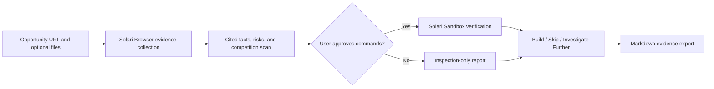

# BuildOrSkip — Solari challenge submission

Built by [Rumi](https://github.com/rumi7911).

## The pitch

Solo developers regularly lose hours evaluating coding challenges before they know whether the
rules, SDK, time commitment, and portfolio payoff make sense. BuildOrSkip turns that scattered
research into a cited decision and then tests the official repository setup in an isolated Solari
sandbox—with explicit consent before any command executes.

The product is deliberately opinionated: it optimizes for portfolio and learning value, exposes
uncertainty, and never predicts that someone will win, receive a prize, or get hired.

## Why it is a strong Solari use case

- **Solari Browser is part of the product, not decoration.** It retrieves public opportunity pages,
  repositories, and documentation, while preserving source-level provenance and partial failures.
- **Solari Sandbox changes the evidence.** After approval, it clones the pinned public repository,
  runs only the displayed allowlist, preserves logs and duration, and updates technical feasibility.
- **Safety is visible.** Source content is treated as untrusted data. Repository code never receives
  the server's Solari API key or the user's local files and credentials.
- **Failure remains useful.** A blocked source, unsupported runtime, or credential boundary produces
  a partial report instead of an invented success.



## Demonstrated live

The canonical Solari investigation has been exercised end to end:

- GitHub and Solari documentation retrieved through the managed Browser SDK.
- The public cookbook cloned at revision `46709a1c374a3d509e8b95f5b5c26095e7c1d7db`.
- Pinned Node.js `20.20.2` verified inside a live Solari sandbox.
- Dependencies installed with lifecycle scripts disabled and zero reported vulnerabilities.
- The credential-dependent nested browser launch labelled **Partially verified**, because BuildOrSkip
  correctly withheld the account-wide server key from third-party repository code.
- Final portfolio verdict remained **Build**, with the incomplete verification lowering confidence
  rather than falsely invalidating the opportunity.

## Review the work

- [43-second product showcase](submissions/build-or-skip/docs/demo/buildorskip-showcase.mp4)
- [Editable showcase source](submissions/build-or-skip/demo-video)
- [Project source and setup](submissions/build-or-skip)
- [Consent-gated runner](submissions/build-or-skip/server/verification.ts)
- [Solari Browser collector](submissions/build-or-skip/server/solari-browser.ts)
- [Decision model](submissions/build-or-skip/shared/decision.ts)
- [Evidence report UI](submissions/build-or-skip/src/App.tsx)
- [Design comparisons](submissions/build-or-skip/docs/design)

## Quality evidence

From `submissions/build-or-skip`:

```bash
npm ci
npm test
npm run typecheck
npm run build
```

The submission currently has 50 automated tests covering decision rules, source handling,
consent gating, sandbox result classification, report export, local persistence, and the main UI
flow. GitHub Actions repeats the test, type-check, and production-build checks on every submission
change.

## Honest boundary

The public app should not expose unlimited access to a long-lived Solari key. A public hosted demo
therefore needs rate limits and a small usage budget, or it should run in the clearly labelled
no-key replay mode. The local live demo remains the strongest way to show both Solari surfaces
without creating an abuse path.

The public showcase video deliberately records that privacy-safe replay and states the limitation
on-screen. It does not claim that the replay is a fresh live SDK execution; the separate live
validation results above remain the technical proof.
