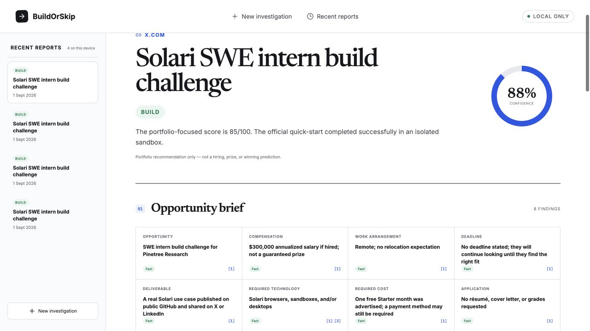

# BuildOrSkip

BuildOrSkip turns a public coding challenge, SDK competition, hackathon, or bounty into an
evidence-backed **Build**, **Skip**, or **Investigate Further** decision. V1 is deliberately
portfolio-first and includes a polished Solari challenge case study.

[Submission brief](../../SUBMISSION.md) · [Solari Browser collector](server/solari-browser.ts) ·
[Consent-gated sandbox runner](server/verification.ts)

[](docs/demo/buildorskip-showcase.mp4)

**[Watch the 43-second product showcase](docs/demo/buildorskip-showcase.mp4).** It uses the
privacy-safe no-key replay and labels that boundary on-screen; the live Browser and Sandbox
validation evidence is documented in the [submission brief](../../SUBMISSION.md).



## Reviewer quick start

```bash
cd submissions/build-or-skip
npm ci
npm test
npm run dev
```

The preloaded Solari case works without credentials and labels its fixture and replay as non-live.
Set `SOLARI_API_KEY` only when reviewing the managed-browser and live-sandbox integrations locally.

## What is implemented

- Public URL intake with optional time, stack, budget, location, related links, screenshots,
  and PDF rules
- Live evidence gathering through the official `@solarisdk/browser` managed-browser SDK when
  `SOLARI_API_KEY` is configured
- Source-level provenance that distinguishes Solari Browser, basic HTTP fallback, user files,
  and the preloaded demo fixture
- Local PDF text extraction; image attachments remain explicitly labelled user-provided
  evidence when OCR is unavailable
- Source-by-source facts labelled Fact, Inference, User-provided, or Unknown
- Hard Skip rules for authoritative expiry, confirmed ineligibility, and over-budget mandatory
  cost
- Transparent six-dimension portfolio score and confidence
- Public GitHub discovery with a server-derived, allowlisted command plan
- Explicit sandbox acknowledgement before any command can run
- Live Solari sandbox integration when `SOLARI_API_KEY` is configured
- Clearly labelled, deterministic demo replay when a Solari key is absent
- Preserved logs, duration, revision, artifacts, failure state, and score update
- Three constrained project directions, local report history, deletion, context recalculation,
  and Markdown export

## Run locally

Requirements: Node.js 20 or newer and npm.

```bash
npm install
npm run dev
```

Open `http://localhost:5173`. The API runs on `http://localhost:8787` and Vite proxies `/api`.

The Solari example works without configuration, but both its preloaded research fixture and
repository replay are visibly labelled as non-live. For the intended submission demo—live
Solari Browser research followed by a real isolated Solari Sandbox run—configure a key:

```bash
cp .env.example .env
# Add SOLARI_API_KEY to .env, then export it in your shell or use your preferred env loader.
SOLARI_API_KEY=your_key npm run dev
```

With a configured key, BuildOrSkip launches one managed Solari Browser session per investigation,
visits the submitted and related public pages, extracts inert HTML evidence, and closes every page
and session. If Solari Browser cannot retrieve a source, the app may try basic HTTP and labels that
fallback in the source ledger.

BuildOrSkip never supplies local user secrets to a repository. After affirmative approval, the
live Solari Sandbox runner creates a fresh five-minute environment, clones one public GitHub
repository, executes only the displayed server-derived allowlist, collects evidence, and destroys
the sandbox. The canonical browser cookbook is tested with pinned Node 20: runtime and dependency
setup are verified live, while its credential-dependent browser launch is reported as partially
verified because the server API key is deliberately withheld from third-party repository code.

## Verification

```bash
npm test
npm run typecheck
npm run build
```

## Architecture

- `src/` — React/Vite product UI, local persistence, export, and local PDF extraction
- `server/` — Express API, Solari Browser collection, decision inputs, and Solari Sandbox runner
- `shared/` — report contracts, published scoring model, and Markdown evidence pack
- `docs/design/` — generated product concepts, design system, and implementation comparison
  captures
- `docs/demo/` — web-optimized 1080p showcase video and poster
- `demo-video/` — editable Remotion source and privacy-safe browser captures used for the video

No account, database, public sharing endpoint, payment flow, or private-resource access is part
of v1.
